# SkillSphere – Student Skill Exchange Platform

SkillSphere is a full-stack student platform for teaching and learning skills, finding study
partners, creating mini-project collaborations, joining communities, and tracking learning
roadmaps. It is intentionally a simple, explainable Spring Boot + React monolith: every feature
uses a clear Controller → Service → Repository flow.

## Stack

- Backend: Java 21, Maven, Spring Boot 3.5.x, Spring Security, JWT, Google OAuth2, BCrypt,
  Spring Data JPA/Hibernate, MySQL/TiDB and PostgreSQL/Neon, Validation, Swagger/OpenAPI,
  Cloudinary-backed file upload
- Frontend: React + Vite using JavaScript, Axios, React Router DOM, Context API, and plain CSS

No microservices, Redis, Kafka, GraphQL, WebSockets, refresh tokens, TypeScript, Redux, or UI
frameworks are used. Docker is used only to package the backend for Render.

## Applications

| Application | Folder | Default address |
| --- | --- | --- |
| Spring Boot API | [`backend`](backend) | `http://localhost:8080` |
| React frontend | [`frontend`](frontend) | `http://localhost:5173` |

## Main modules

- Registration, login, BCrypt password hashing, 30-minute JWTs, Google OAuth2, RBAC, first admin bootstrap
- Public/student profiles, picture upload, profile visibility/verification, and profile search
- Rich teaching/learning skills, student projects with image upload, communities/resources/memberships
- Roadmaps with completed items and calculated progress
- Profile/community bookmarks, collaboration requests, REST notifications, reports, announcements
- Admin user verification/deletion, report resolution, content removal, community and skill management
- Pagination, validation, global exception handling, Swagger/OpenAPI documentation

## Authentication flow

```mermaid
flowchart LR
    A["React login/register"] --> B["AuthController"]
    B --> C["AuthenticationManager"]
    C --> D["DaoAuthenticationProvider"]
    D --> E["UserDetailsService + JPA"]
    E --> F["BCrypt verification"]
    F --> G["JWT: username, email, role, issued/expiry"]
    G --> H["React local storage"]
    H --> I["Bearer token on Axios requests"]
    I --> J["JWT filter restores SecurityContext"]
```



Google sign-in uses Spring Security's OAuth2 client, creates a local user on the first successful
Google login, creates the same application JWT, and redirects to the React OAuth callback.

## Run locally

1. Start MySQL and use the requested database configuration:

   ```text
   database: skill_sphere_db
   username: root
   password: root
   ```

2. Configure the backend environment. See [`backend/.env.example`](backend/.env.example). At a
   minimum, set a Base64 JWT secret before starting:

   ```bash
   export JWT_SECRET="$(openssl rand -base64 48)"
   ```

   Google values remain placeholders until you create OAuth credentials; see the backend README.

3. Start the backend:

   ```bash
   cd backend
   mvn spring-boot:run
   ```

4. Start the frontend in another terminal:

   ```bash
   cd frontend
   cp .env.example .env
   npm install
   npm run dev
   ```

5. Open `http://localhost:5173`. Swagger UI is at `http://localhost:8080/swagger-ui.html`.

Initial administrator creation is disabled by default. Set `ADMIN_EMAIL` and
`ADMIN_INITIAL_PASSWORD` to seed one secure account when no administrator exists.

## Cloud deployment

The same backend JAR supports both portfolio deployments:

- `SPRING_PROFILES_ACTIVE=tidb` selects MySQL Connector/J for TiDB Cloud.
- `SPRING_PROFILES_ACTIVE=neon` selects pgJDBC for Neon PostgreSQL.

The repository includes a Render Blueprint, a backend Dockerfile, Vercel SPA routing, persistent
Cloudinary image storage, and a health endpoint. See [deployment guide](docs/DEPLOYMENT.md).

## Verification

```bash
cd backend && mvn test
cd frontend && npm run build
```

See [API examples](docs/API_EXAMPLES.md), [backend setup](backend/README.md), and
[frontend setup](frontend/README.md) for details.
