# SkillSphere – Student Skill Exchange Platform

SkillSphere is a full-stack student platform for teaching and learning skills, finding study
partners, creating mini-project collaborations, joining communities, and tracking learning
roadmaps. It is intentionally a simple, explainable Spring Boot + React monolith: every feature
uses a clear Controller → Service → Repository → MySQL flow.

## Stack

- Backend: Java 21, Maven, Spring Boot 3.5.x, Spring Security, JWT, Google OAuth2, BCrypt,
  Spring Data JPA/Hibernate, MySQL, Validation, Swagger/OpenAPI, file upload
- Frontend: React + Vite using JavaScript, Axios, React Router DOM, Context API, and plain CSS

No microservices, Docker, Redis, Kafka, GraphQL, WebSockets, refresh tokens, TypeScript, Redux,
or UI frameworks are used.

## Applications

| Application | Folder | Default address |
| --- | --- | --- |
| Spring Boot API | [`backend`](backend) | `http://localhost:8080` |
| React frontend | [`frontend`](frontend) | `http://localhost:5173` |

## Main modules

- Registration, login, BCrypt password hashing, 30-minute JWTs, Google OAuth2, RBAC, first admin bootstrap
- Public/student profiles, picture upload, profile visibility/verification, and profile search
- Rich teaching/learning skills, student projects with image upload, communities/resources/memberships
- Roadmaps with completed items and calculated progress
- Profile/community bookmarks, collaboration requests, REST notifications, reports, announcements
- Admin user verification/deletion, report resolution, content removal, community and skill management
- Pagination, validation, global exception handling, Swagger/OpenAPI documentation

## Authentication flow

```mermaid
flowchart LR
    A["React login/register"] --> B["AuthController"]
    B --> C["AuthenticationManager"]
    C --> D["DaoAuthenticationProvider"]
    D --> E["UserDetailsService + MySQL"]
    E --> F["BCrypt verification"]
    F --> G["JWT: username, email, role, issued/expiry"]
    G --> H["React local storage"]
    H --> I["Bearer token on Axios requests"]
    I --> J["JWT filter restores SecurityContext"]
```

Google sign-in uses Spring Security's OAuth2 client, creates a local user on the first successful
Google login, creates the same application JWT, and redirects to the React OAuth callback.

`http://localhost:5173`. Swagger UI is at `http://localhost:8080/swagger-ui.html`.

